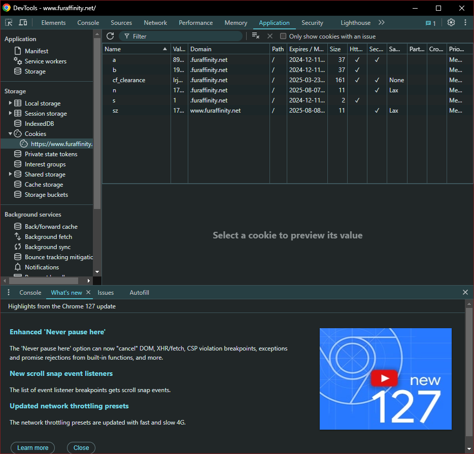
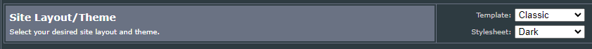

# fadownload
Download all submissions, scraps, and journals for a user from FurAffinity.

## I know what I'm doing

Copy fadownload.example.toml to fadownload.toml and fill in the required values for FurAffinity cookies.
Get them from your web browser's dev tools.
I'd use a throwaway account, not your main account, just in case.

Make sure that the account you use with this has the Classic UI template selected, or some things may not work right.

Usage: `go run . -user user-to-download -output directory/to/store/files`

## I need more details

You need to install [Go](https://go.dev/dl/) to be able to compile this program.
I might have put some binaries in the [Releases](https://github.com/ajanata/fadownload/releases) page, if you trust me and don't want to compile it yourself.

Copy fadownload.example.toml to fadownload.toml and fill in the required values for FurAffinity cookies.
You can get those from your web browser's dev tools:
Open FA (make sure you're logged in), then hit F12 (at least in Chrome).
Go to the Application tab on the top, expand Cookies on the left, and select `https://www.furaffinity.net`.
You should see a list of all the cookies your browser has.
You need to put these into your fadownload.toml at the bottom, following the examples there.
At the very least you need the `a` and `b` cookies, but it doesn't hurt to copy them all over.

It's also important to make sure your account is set to use the Classic UI.
You can change that setting on the [Account Management](https://www.furaffinity.net/controls/settings/) page.

Once you've got all that done, open a command prompt wherever you downloaded this.

If you're using Go and the source code, you want to type `go run . -user user-to-download -output directory/to/store/files`.

If you've downloaded a binary, you want to type `fadownload -user user-to-download -output directory/to/store/files`.

This might take a while, depending on how much stuff the user has.
